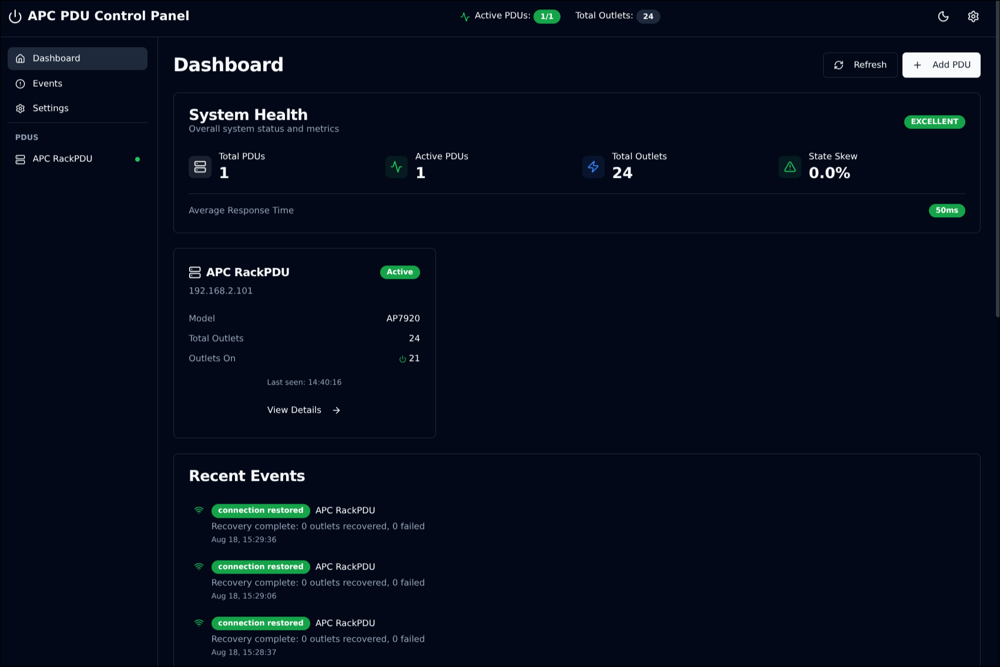
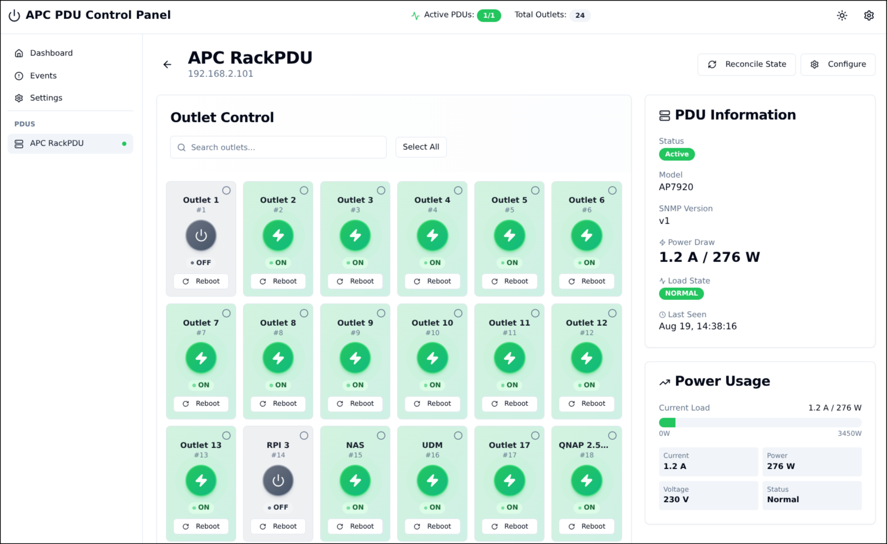
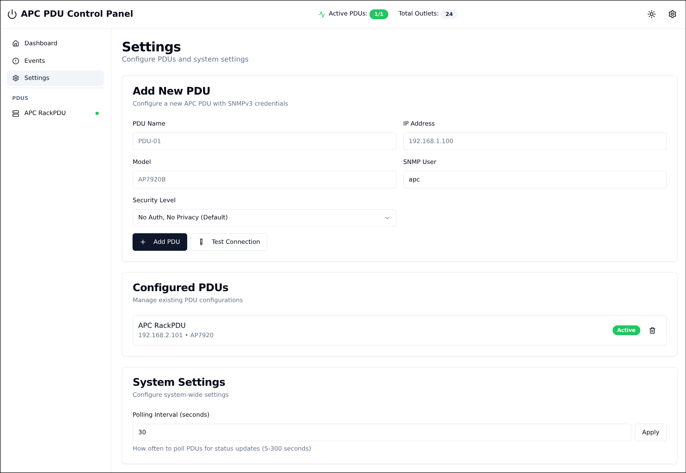

# APC PDU Control System

Complete web-based control system for APC Switched Rack PDUs with real-time monitoring, state management, and power metrics tracking.


## 📸 Screenshots

### Dashboard - Dark Mode

*Modern dark theme interface with system health metrics and real-time PDU status monitoring*

### Outlet Control Panel

*Compact outlet cards with circular power buttons, device names prominently displayed, and visual power state indicators*

### Settings & Configuration

*PDU configuration interface with SNMP settings and system-wide configuration options*

## 🎨 Modern Interface

The APC PDU Control System features a sleek, modern interface designed for efficiency and ease of use:

### Key Interface Features
- **🌓 Dark Mode Support**: Automatic theme detection with manual toggle
- **📱 Responsive Design**: Adapts from mobile (2 columns) to desktop (6 columns)
- **🔍 Smart Search**: Real-time outlet filtering by name or number
- **⚡ Visual Power States**: Color-coded outlets with animated status indicators
- **✨ Modern Aesthetics**: Glass-morphism effects with smooth animations

### Outlet Control Interface
The main control panel displays all outlets in a compact grid layout:
- **Green outlets** indicate powered-on state with lightning bolt icons
- **Gray outlets** show powered-off state
- **Device names** are prominently displayed (e.g., "NAS", "UDM", "RPI 5")
- **Quick actions** include individual power toggle and reboot buttons
- **Bulk operations** support selecting multiple outlets for group control

## 🚀 Features

### Core Functionality
- **Multi-Protocol SNMP Support**: SNMPv1, SNMPv2c, and SNMPv3 with various security levels
- **Real-time Outlet Control**: Individual and bulk control (ON/OFF/REBOOT)
- **Power Monitoring**: Real-time power consumption in Amps and Watts (EU 230V standard)
- **State Management**: Automatic reconciliation between desired and actual states
- **Reboot Recovery**: Automatic detection and recovery from PDU reboots
- **WebSocket Updates**: Real-time state changes across all connected clients
- **Scheduled Operations**: Schedule outlet operations for future execution
- **Event Logging**: Comprehensive event history with export capabilities
- **PDU Configuration**: Edit PDU settings through intuitive dialog interface

### User Experience
- **Dark/Light Theme**: System-aware theme with manual override
- **Keyboard Shortcuts**: Efficient navigation and control
- **Search & Filter**: Quick outlet discovery with real-time search
- **Bulk Selection**: Select all/deselect all for efficient management
- **Visual Feedback**: Animated transitions and hover effects
- **Critical Outlet Protection**: Visual warnings and disabled controls for protected outlets
- **State Mismatch Indicators**: Clear visual cues when desired state differs from actual

### Supported PDU Models
- **AP7951**: 1G PDU with 24 outlets, SNMPv1, power monitoring supported
- **AP7920**: 1G PDU with 8 outlets, basic power monitoring
- **AP84XX/86XX/88XX**: 2G PDUs with full per-outlet monitoring

## 🛠️ Tech Stack

### Backend
- **Runtime**: Bun
- **Framework**: Elysia
- **Database**: PostgreSQL with Drizzle ORM
- **Protocol**: SNMP (v1/v2c/v3)
- **Real-time**: WebSocket

### Frontend
- **Framework**: React 19 with TypeScript
- **Build Tool**: Vite
- **UI Components**: shadcn/ui with Tailwind CSS
- **State Management**: Zustand
- **API Client**: React Query
- **Icons**: Lucide React
- **Theme Management**: Context API with localStorage persistence

## 📦 Prerequisites

- Docker & Docker Compose (recommended)
- OR:
  - Node.js 18+ & Bun 1.0+
  - PostgreSQL 16+
  - net-snmp utilities

## 🚀 Quick Start

### Using Docker (Recommended)

1. **Clone the repository**:
```bash
git clone https://github.com/tom130/apc-pdu-control.git
cd apc-pdu-control
```

2. **Start all services**:
```bash
make docker-up
# or
docker-compose up -d
```

3. **Access the application**:
- Frontend: http://localhost:5173
- Backend API: http://localhost:3001
- API Documentation: http://localhost:3001/swagger
- pgAdmin (optional): http://localhost:5050

### Local Development

1. **Install dependencies**:
```bash
make install
```

2. **Start PostgreSQL**:
```bash
make postgres
```

3. **Start development servers**:
```bash
make dev
```

This will start both frontend and backend in development mode with hot reloading.

## 💻 User Interface Guide

### Main Control Panel
The outlet control grid provides an at-a-glance view of all PDU outlets:
- **Compact Cards**: Each outlet displays name, number, power state, and controls
- **Visual States**: Green for ON (with lightning icon), Gray for OFF
- **Quick Actions**: One-click power toggle and reboot per outlet
- **Bulk Operations**: Select multiple outlets for group control

### Navigation
- **Dashboard**: System overview with health metrics and recent events
- **PDU Details**: Individual PDU control and real-time power monitoring
- **Events**: Complete event history with filtering and export
- **Settings**: PDU configuration and system preferences

### Power Monitoring Display
Real-time power metrics shown in the sidebar:
- Current draw in Amperes
- Power consumption in Watts (calculated at 230V EU standard)
- Visual gauge showing load percentage
- Load state indicator (NORMAL/WARNING/CRITICAL)

## 📁 Project Structure

```
apc-pdu-control/
├── backend/              # Backend API service
│   ├── src/             # Source code
│   │   ├── routes/      # API endpoints
│   │   ├── services/    # Business logic
│   │   └── db/          # Database schema
│   ├── Dockerfile       # Backend container
│   └── package.json     # Backend dependencies
│
├── frontend/            # React frontend
│   ├── src/            # Source code
│   │   ├── components/ # React components
│   │   ├── pages/      # Page components
│   │   ├── providers/  # Context providers
│   │   └── api/        # API client
│   └── package.json    # Frontend dependencies
│
├── docker-compose.yml   # Full stack orchestration
└── Makefile            # Development commands
```

## 🔧 Configuration

### SNMP Settings

The system supports multiple SNMP versions:

- **SNMPv1/v2c**: Uses community strings
  - Read: `public` (default)
  - Write: `private` (default)
  
- **SNMPv3**: User-based security
  - `noAuthNoPriv`: No authentication (APC default)
  - `authNoPriv`: Authentication only
  - `authPriv`: Full security (recommended)

### Environment Variables

Create `.env` files in both `backend/` and `frontend/` directories. See `.env.example` files for templates.

Key backend configurations:
- `DATABASE_URL`: PostgreSQL connection string
- `ENCRYPTION_KEY`: 32-character key for encrypting SNMP credentials
- `STATE_RECONCILIATION_INTERVAL`: State sync frequency (ms)
- `PDU_POLLING_INTERVAL`: PDU polling frequency (ms)

## 📊 Power Monitoring

The system displays power consumption in both:
- **Amperes**: Direct current draw
- **Watts**: Calculated using EU standard 230V

Example display: `1.3 A / 299 W`

**Note**: Some older PDU models may not support power monitoring via SNMP.

## 🛠️ Available Commands

```bash
# Development
make dev           # Start full stack development
make backend-dev   # Start only backend
make frontend-dev  # Start only frontend
make test         # Run all tests

# Docker
make docker-up    # Start all services
make docker-down  # Stop all services
make docker-logs  # View logs
make docker-clean # Clean up containers

# Utilities
make pgadmin      # Start pgAdmin interface
make test-power   # Test power metrics endpoint
```

## 🔌 API Documentation

The backend provides a comprehensive REST API with Swagger documentation:

- **Swagger UI**: http://localhost:3001/swagger
- **WebSocket**: ws://localhost:3001/ws

Main endpoints:
- `/api/pdus` - PDU management
- `/api/pdus/:id/outlets` - Outlet control
- `/api/pdus/:id/metrics` - Power metrics
- `/api/system/health` - System health

## 🐛 Troubleshooting

### SNMP Connection Issues
```bash
# Test SNMPv1 connectivity
snmpwalk -v1 -c public <pdu-ip>

# Test SNMPv3 connectivity
snmpwalk -v3 -u <user> -l noAuthNoPriv <pdu-ip>
```

### Power Metrics Not Showing
1. Verify PDU supports power monitoring
2. Check if using correct OID format (indexed for AP7951)
3. Review backend logs: `docker-compose logs backend | grep Power`

### State Reconciliation
```bash
# Force manual reconciliation
curl -X POST http://localhost:3001/api/pdus/<pdu-id>/reconcile
```

## 🤝 Contributing

1. Fork the repository
2. Create a feature branch
3. Commit your changes
4. Push to the branch
5. Create a Pull Request

## 📄 License

MIT License - see LICENSE file for details

## 🙏 Acknowledgments

- Original PHP implementation by [Roberto Di Sisto](https://github.com/disisto/apc-switched-rack-pdu-control-panel)
- SNMP library reference from [apc-pdu-snmp](https://github.com/phillipsnick/apc-pdu-snmp)

## 📞 Support

For issues and questions:
- Create an issue on GitHub
- Check existing issues for solutions
- Review the troubleshooting section

---

**Note**: This system is designed for managing APC Switched Rack PDUs in a controlled environment. Always ensure proper network security when exposing SNMP-enabled devices.